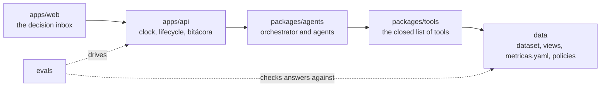
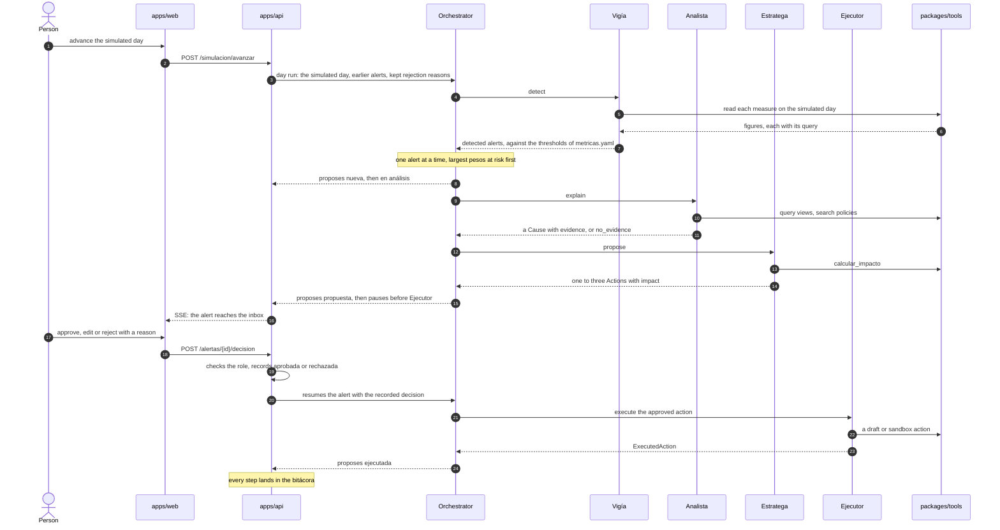
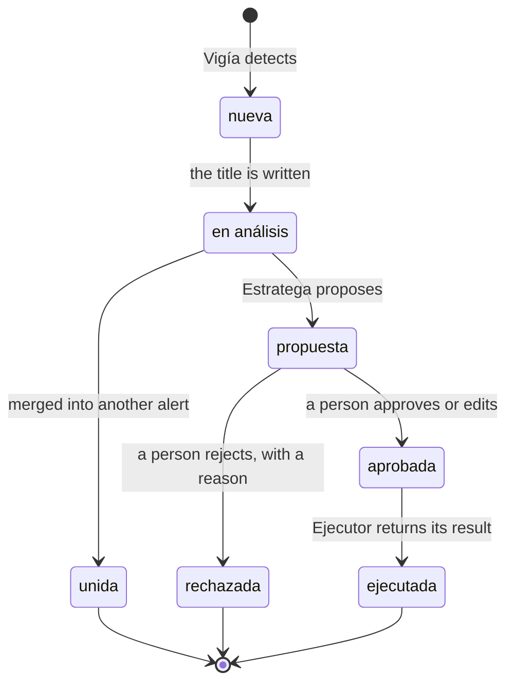

# How an alert crosses the parts

This chapter follows one alert through the monorepo, so that each level page after it has a place
in one picture. It states no rule of its own: each step names the page that owns it, and each
diagram names the section it draws.

> **Decided, not implemented.** The journey below is what the level pages decide. Which part of
> it runs as code today is [What exists today](./status.md).

## The chain

*Draws: `AGENTS.md` § How the parts connect*

Each arrow is a call, and nothing calls back up the chain. The rule and what holds it are on
[the project page](../../../AGENTS.md); what each part decides is its own page under *The levels*.

## One alert, from the clock to the log

*Draws: `AGENTS.md` § How the parts connect; `packages/agents/AGENTS.md` § The orchestrator's graph*

The steps, each with the page that owns it:

- **The clock.** `apps/api` owns the simulated day, which replaces `fecha_corte()`
  ([apps/api](../../../apps/api/AGENTS.md)); which views ignore that day is the clock section of
  [data](../../../data/AGENTS.md).
- **Detection.** `Vigía` fires on written thresholds only, one alert per metric and entity, and
  computes pesos at risk in SQL ([packages/agents](../../../packages/agents/AGENTS.md)).
- **Explanation.** `Analista` proves a cause by entity, time and direction, or answers that the
  evidence is not enough; when its cause already explains another open alert, the orchestrator
  merges the two.
- **Proposal.** `Estratega` picks only actions its skill lists for the metric, and every amount comes
  from `calcular_impacto` ([packages/tools](../../../packages/tools/AGENTS.md)).
- **Approval.** The graph pauses before `Ejecutor` and resumes only with a decision `apps/api`
  recorded; a rejection's reason is kept and routed back to the agent it concerns.
- **Execution.** `Ejecutor` turns the approved action into a draft, unchanged, and a second run has
  no effect.
- **The log.** Every step lands in the `bitácora`, which `apps/api` owns and nothing updates.

## The lifecycle of an alert

*Draws: `apps/api/AGENTS.md` § Decisions*

The orchestrator proposes each transition an agent causes, and `apps/api` proposes the ones a
person causes; `apps/api` validates and persists all of them, because it is the only part with
storage. `unida` is the one state the brief's lifecycle lacks, and
[apps/api](../../../apps/api/AGENTS.md) says why it exists.
