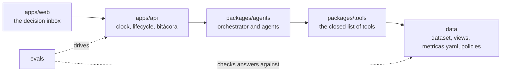
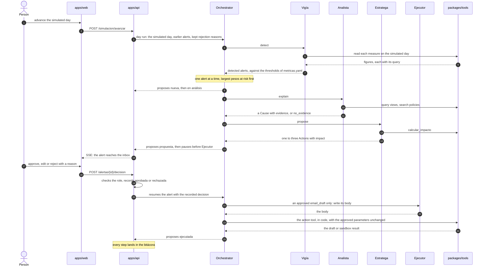
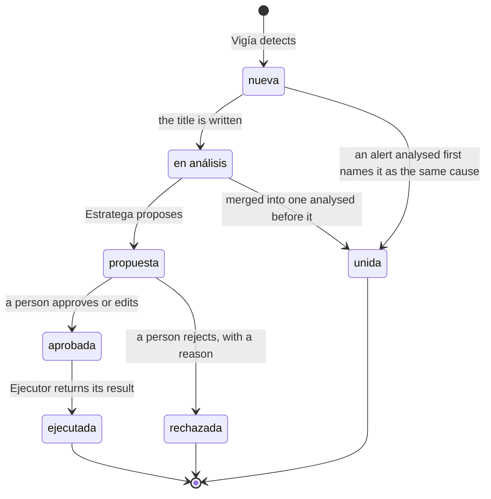

# How an alert crosses the parts

This chapter follows one alert through the monorepo, so that each level page after it has a place
in one picture. It states no rule of its own: each step names the page that owns it, and each
diagram names the section it draws.

The journey below is what the level pages decide. Which part of it runs as code is
[What runs and what is decided](./status.md).

## The chain

*Draws: `AGENTS.md` § How the parts connect*

Each arrow is a call, and nothing calls back up the chain. The rule and what holds it are on
[the project page](../../../AGENTS.md); what each part decides is its own page under *The levels*.

## One alert, from the clock to the log

> **Decided, not built.** The day run, every model call, `calcular_impacto`, the action tools and
> all of `apps/api`. Of this diagram, the walk of `detectar`, the pause at `aprobar.decision` and
> the resume with a recorded decision run, with stub leaves and no model.

*Draws: `AGENTS.md` § How the parts connect; `packages/agents/AGENTS.md` § The day run; `packages/agents/AGENTS.md` § The alert graph*

Each step, and the section of the page that owns it:

- **The clock**: [apps/api](../../../apps/api/AGENTS.md), *The clock*; which views ignore the
  simulated day, [data](../../../data/AGENTS.md), *The simulated clock*.
- **Detection**: what `Vigía` fires on, how often it raises an alert again and where its pesos at
  risk come from, [packages/agents](../../../packages/agents/AGENTS.md), *`Vigía` detects*; the
  nodes it walks, [the tree](../../../packages/agents/arbol/AGENTS.md), *The stages*.
- **Order and merging**: [packages/agents](../../../packages/agents/AGENTS.md), *The day run*.
- **Explanation**: [packages/agents](../../../packages/agents/AGENTS.md), *`Analista` explains,
  and answers the chat*.
- **Proposal**: [packages/agents](../../../packages/agents/AGENTS.md), *`Estratega` proposes*; the
  figures, [packages/tools](../../../packages/tools/AGENTS.md), *The impact calculator*.
- **Approval**: the checks on a decision, [apps/api](../../../apps/api/AGENTS.md), *Decisions and
  roles*; the pause and the resume, [packages/agents](../../../packages/agents/AGENTS.md), *The
  alert graph*; the routing of a rejection's reason, the same page, *Routing*.
- **Execution**: the check that the condition still holds,
  [the tree](../../../packages/agents/arbol/AGENTS.md), *The node ejecutar.vigente*; what
  `Ejecutor` may do, [packages/agents](../../../packages/agents/AGENTS.md), *`Ejecutor` acts after
  a decision*; why a second run has no effect, [packages/tools](../../../packages/tools/AGENTS.md),
  *Actions and idempotency*.
- **The log**: [apps/api](../../../apps/api/AGENTS.md), *The `bitácora`*.

## The lifecycle of an alert

*Draws: `apps/api/AGENTS.md` § The alert lifecycle*

Who proposes each transition, who records it, and why `unida` exists beside the brief's states is
[apps/api](../../../apps/api/AGENTS.md), *The alert lifecycle*.
