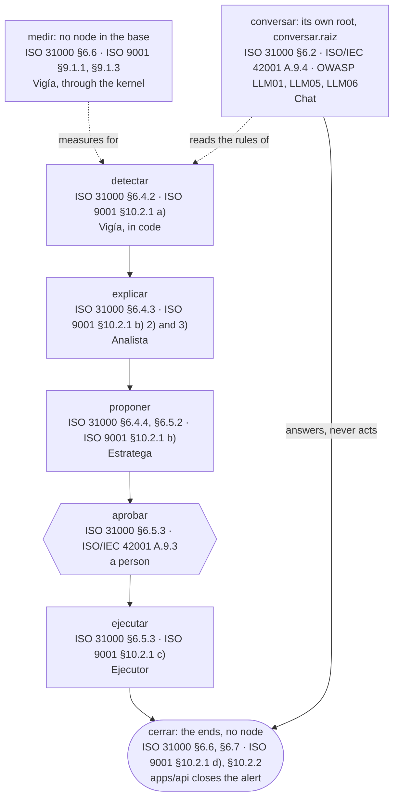
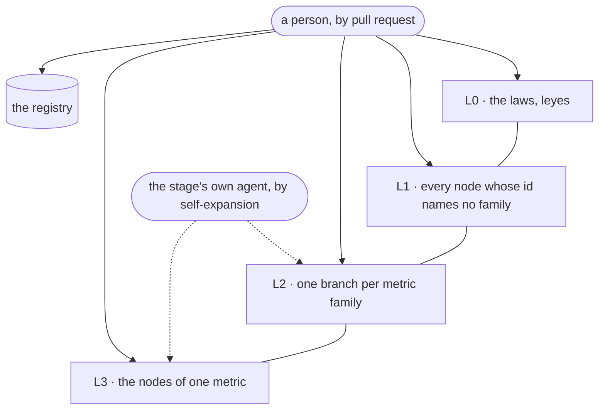
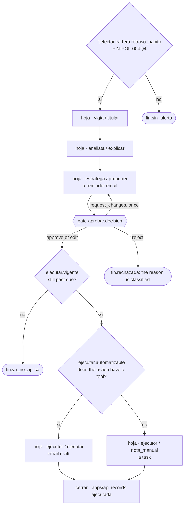

# The decision tree

The decision tree holds every route of an alert in one artefact that is **data, validated by code,
and walked by a deterministic interpreter**. How it is written, validated and grown is
[the tree's page](../../../packages/agents/arbol/AGENTS.md); how the compiled graph runs an alert is
[packages/agents](../../../packages/agents/AGENTS.md). This chapter keeps what founds the tree,
drawings of its stages, its levels and one walk.

## What founds it

Why a standard founds structure and never a threshold, and how an entry joins the registry, is
[the tree's page](../../../packages/agents/arbol/AGENTS.md), *The tree*. ISO 31000 and ISO 9001
say *that* risk is evaluated against criteria, not *which* criteria a distributor uses; these are
the standards the tree rests on:

| Standard | Founds |
|---|---|
| ISO 31000:2018, risk management | the stages of the tree and their order |
| ISO 9001:2026, quality management | §9.1: the KPI kernel and `Vigía` as owner of measurement; §10.2: the stages read as react, find the cause, find similar cases, act, review effectiveness |
| ISO/IEC 42001:2023, AI management system | the laws on human approval, on what an agent may change, and on the `bitácora` |
| ISO 22400-2:2014+A1:2017, KPI description | the fields of a KPI in the kernel |
| Goal-Question-Metric (Basili, Caldiera and Rombach, 1994) | the only admissible justification for a new KPI: a node asks a question no KPI answers |
| OWASP Top 10 for LLM Applications 2025 | the controls of the stage `conversar` against prompt injection, improper output handling and excessive agency, which no ISO clause of the registry names |

GQM is a method, not a standard; it is admitted because it ties a metric to the decision it serves.
Every clause a node may cite is an entry of [the registry](../../../packages/agents/arbol/fundamentos.yaml).

## The stages

*Draws: `packages/agents/arbol/AGENTS.md` § The stages; `packages/agents/arbol/AGENTS.md` § The ends; `packages/agents/arbol/AGENTS.md` § The chat*

Each clause is the `funda` of a registry entry. A stage is the first segment of a node's id, not a
level: which nodes are L1 is the next diagram.

## The node

What a node, a leaf and an end hold, the atomicity test, and what the validator refuses are
[the tree's page](../../../packages/agents/arbol/AGENTS.md), *The node*, *The ends* and *The
validator*. The base itself is `packages/agents/arbol/base.yaml`.

## The levels and who changes them

*Draws: `packages/agents/arbol/AGENTS.md` § The levels; `packages/agents/arbol/AGENTS.md` § How the tree grows*

The dashed arrows are self-expansion, which `Estratega` drafts today. The laws L0 holds are the `leyes` of
`packages/agents/arbol/base.yaml`, each on its registry entry; what never grows at runtime, and
why, is [the tree's page](../../../packages/agents/arbol/AGENTS.md), *How the tree grows*.

## How the tree grows

How an expansion is drafted, checked, capped, recorded and retired is
[the tree's page](../../../packages/agents/arbol/AGENTS.md), *How the tree grows*; where a client's
versions live is [the API's page](../../../apps/api/AGENTS.md), *The tree's versions*.

## Walkthrough: a customer who paid in 30 days is 6 days late

> **Decided, not built.** `detectar.cartera.retraso_habito` and the KPI it reads are in no file:
> steps 1 and 2 need the birth of a KPI and self-expansion. From `hoja.vigia.titular` on, the walk
> follows nodes of the base, and every model step runs only as a stub.

*Draws: `packages/agents/arbol/AGENTS.md` § The stages; `packages/agents/arbol/AGENTS.md` § The ends; `packages/agents/arbol/AGENTS.md` § The node ejecutar.vigente*

1. **On the base, `detectar` fires nothing.** `saldo_vencido` fires above 15 days and
   `dias_pago_prom` above a 50% rise; a 6-day delay on a 30-day habit crosses neither, while
   `FIN-POL-004 §4` prescribes a reminder from day 1. The missing measure is a `kpi_gap`, which
   [the kernel](./kpi-kernel.md) turns into a proposed KPI. Whether it is a measure gap or only a
   threshold gap on `saldo_vencido`, whose `tramos` already name 1 to 15 days, is undecided.
2. Once the administrator approves that KPI, `Vigía` self-expands `detectar` with
   `detectar.cartera.retraso_habito`; on the next simulated day it fires and `vigia`/`titular`
   writes the title.
3. `explicar`: `Analista` crosses payments and behaviour. A customer's goal, such as "a target of
   $1,000 in six months", has no source in the data and joins what the data cannot answer.
4. `proponer`: `Estratega` takes the rows of its action list for the metric; a reminder email is
   what `FIN-POL-004 §4` prescribes for 1 to 15 days.
5. `aprobar`: the person approves, edits, rejects, or requests changes once, as
   [apps/api](../../../apps/api/AGENTS.md) states under *Decisions and roles*.
6. `ejecutar.vigente`: the invoice is still past due. `ejecutar.automatizable`: an email draft has a
   tool, so `ejecutor`/`ejecutar`; an action the policy prescribes with no tool, such as a phone
   call, becomes a `task` for a person through `nota_manual`.
7. `cerrar`: `apps/api` records the result and moves the alert to `ejecutada`.

A chat question walks the tree too, from its own root `conversar.raiz`, and never reaches
`aprobar`: its nodes and why the validator holds that are
[the tree's page](../../../packages/agents/arbol/AGENTS.md), *The chat*.
