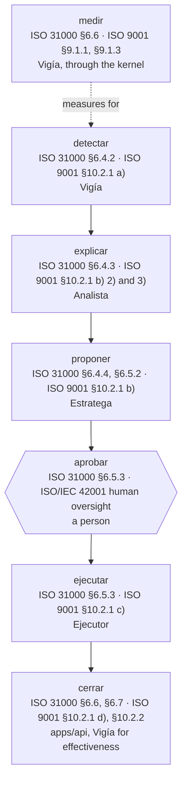
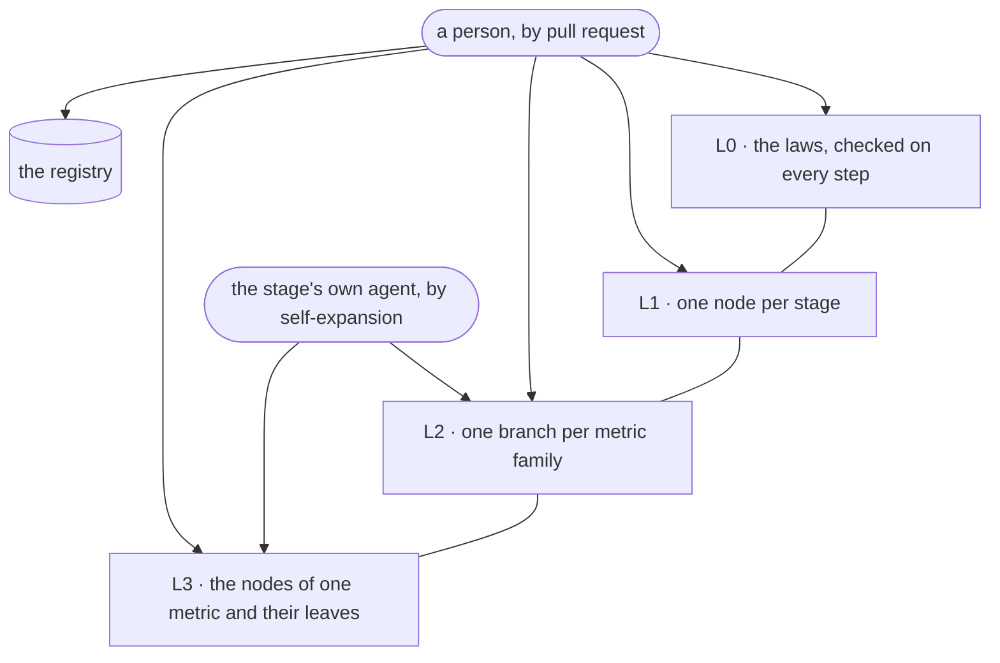
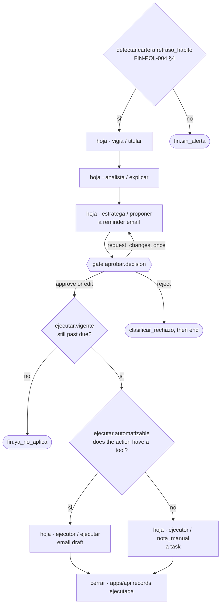

# The decision tree

The decision tree replaces the routing that today is spread over the sections of each agent and
the orchestrator's table of nodes and edges: one artefact that is **data, validated by code, and
walked by a deterministic interpreter**. The model acts only at a leaf. This chapter owns what the
tree is until [packages/agents](../../../packages/agents/AGENTS.md) states it.

> **Decided, not implemented.** Only the registry of `fundamentos` exists as a file. No node, no
> validator and no interpreter exist yet.

## What founds it

A standard founds structure, never a threshold. A business threshold still quotes a policy section
or the kit in `fuente_umbral`, so a node that compares a KPI with a number takes the number from
`metricas.yaml`, and a node founded on an ISO clause compares a state, never a figure. ISO 31000
and ISO 9001 say *that* risk is evaluated against criteria, not *which* criteria a distributor uses.

| Standard | Founds |
|---|---|
| ISO 31000:2018, risk management | the stages of the tree and their order |
| ISO 9001:2015, quality management | §9.1: the KPI kernel and `Vigía` as owner of measurement; §10.2: the stages read as react, find the cause, find similar cases, act, review effectiveness |
| ISO/IEC 42001:2023, AI management system | the laws on human approval, on what an agent may change, and on the `bitácora` |
| ISO 22400-2:2014, KPI description | the fields of a KPI in the kernel |
| Goal-Question-Metric (Basili, Caldiera and Rombach, 1994) | the only admissible justification for a new KPI: a node asks a question no KPI answers |

GQM is a method, not a standard; it is admitted because it ties a metric to the decision it serves.
Every clause a node may cite is an entry of [the registry](../../../packages/agents/arbol/fundamentos.yaml),
which only a person extends, and whose clauses are unverified until a person with the licensed texts
confirms them ([Debts](../../../DOUBTS.md)).

## The stages, level L1



`cerrar`'s effectiveness review, whether the metric of an executed alert returns inside its
threshold on later simulated days, is roadmap; `cerrar` records the action, its result and who
made it, and updates the alert's state.

## The words

| Term | Meaning |
|---|---|
| rule | one predicate: one operand compared with one value or one other operand by one operator of a closed list |
| node | a rule plus its `fundamento` and its two branches, `si` and `no` |
| `fundamento` | the clause of a standard or the policy section a node rests on; exactly one per node, taken from the registry |
| leaf | the end of a path: one agent, one decision from that agent's closed list, and the skill it loads |
| gate | a node whose operand is a decision a person recorded |
| self-expansion | a change to the tree an agent produces as output, validated by code and persisted by `apps/api`, with no person's approval before it |

**The atomicity test.** A node is atomic when its predicate holds one operator and no `and`, `or`
or `not`, and its `fundamento` names one entry of the registry. A node that splits into two
independent predicates is two nodes, because the atomic node is the unit a client changes.

## The node

The base lives in `packages/agents/arbol/` as YAML beside the registry, because routing is the
orchestrator's concern and YAML matches `metricas.yaml`, which predicates read. A predicate holds
no literal threshold: it names the metric whose `umbral_alerta` it applies.

```yaml
version: 1
nodos:
  - id: detectar.cartera.vencida
    fundamento: fin-pol-004.s4
    predicado: { lee: kpi.saldo_vencido.max_dias_vencido, op: ">", umbral: saldo_vencido }
    si: hoja.vigia.titular
    no: fin.sin_alerta
  - id: hoja.vigia.titular
    hoja: { agente: vigia, decision: titular, skill: vigia/contrato.md }
    sigue: explicar.raiz
```

| Field | Rule |
|---|---|
| `id` | unique; its first segment is a stage, or `hoja`, or `fin` |
| `fundamento` | one entry of the registry; required on a node, absent on a leaf, which inherits its parent's |
| `predicado.lee` | a KPI column of the kernel (`kpi.<metric>.<column>`) or a declared field of the alert's state |
| `predicado.op` | one of `>`, `>=`, `<`, `<=`, `=`, `!=`, `en`, `existe` |
| `predicado.umbral` or `valor` | `umbral` names a metric of `metricas.yaml`; a literal `valor` is admitted only for a state field |
| `si`, `no` | both required, each a node, a leaf or an end |
| `hoja` | `agente`, a `decision` from that agent's closed list, and a `skill` under `packages/agents/skills/` |
| `sigue` | on a leaf: the node the walk continues at once the agent returns |

The closed decisions per agent: `vigia` takes `detectar` (code), `titular`, `proponer_kpi`,
`expandir`; `analista` takes `explicar`, `responder_chat`, `expandir`; `estratega` takes
`proponer`, `revision_manual` (code), `expandir`; `ejecutor` takes `ejecutar`, `nota_manual`,
`expandir`.

**The tree compiles to the LangGraph graph.** Each leaf becomes a graph node, each predicate the
function of a conditional edge, and the approval interrupt sits before every `Ejecutor` leaf. The
base is validated at startup, and an invalid base stops the start. The fallbacks of a failed step,
the token cap, the retry and the order of a day's alerts stay settings of the interpreter, because
they decide *how* a step runs, not *which* step runs.

## The levels and who changes them



The base's L2 families are `cartera`, `margen`, `inventario`, `comercial`, `abastecimiento` and
`clientes`. L0 holds the laws every path obeys; they are not branches, and a step that breaks one
fails:

| Law | `fundamento` |
|---|---|
| every figure comes from a logged query | the brief's golden rule; ISO 9001 §7.5 |
| no action without a recorded human approval | ISO/IEC 42001 human oversight |
| no agent changes a database | ISO/IEC 42001 §8 |
| data and documents are data, never instructions | ISO/IEC 42001 §6.1 |
| "not enough evidence" is a complete answer | ISO 31000 §6.4.3 |
| an agent uses only the tools its label allows | ISO/IEC 42001 §8 |
| every step lands in the `bitácora` | ISO 31000 §6.7; ISO 9001 §10.2.2 |

**What never grows at runtime:** L0, L1, the registry, the kernel's language, the list of tools,
the closed decisions per agent, and the dataset. Each one bounds what does grow, and a bound that
moves with what it bounds is no bound.

## The validator

Code in `packages/agents`, run at startup and as a test. It refuses a tree where:

- a node fails the schema, or a predicate fails the atomicity test;
- a node lacks its `fundamento`, its `si` or its `no`, or cites a `fundamento` absent from the registry;
- a path reaches an `Ejecutor` leaf without passing the gate `aprobar.decision` and the node `ejecutar.vigente`;
- the graph has a cycle other than the two capped returns, `proponer` → `explicar` and `aprobar.recargar` → `proponer`;
- a path from the root reaches no `fin`;
- a `lee` names a KPI column the kernel does not build, or a state field the alert's state does not declare;
- an `umbral` names a metric absent from `metricas.yaml` and from the client's approved KPIs;
- a leaf's `skill` does not exist, or its `decision` is outside its agent's list;
- an L0 or L1 node differs from the base.

A metric with no L3 branch, or an L3 leaf whose skill is missing, is a refusal instead of a gap.

## How the tree grows

**Any agent may expand the tree, only inside its own stage and with leaves of its own label**:
`Vigía` in `detectar` and `medir`, `Analista` in `explicar`, `Estratega` in `proponer`, `Ejecutor`
in `ejecutar`. `aprobar` and `cerrar` have no agent, so they grow by pull request only. An expansion
is one of three moves and no other:

| Move | What it does | Why it is safe |
|---|---|---|
| add a branch | a new L3 node under an L2 family of the agent's stage, or a new L2 family | no existing path changes |
| split a leaf | a leaf of the agent's label becomes a node whose one branch is the old leaf and whose other is a new leaf of the same label | the old behaviour survives on one branch |
| retire a branch | an L2 or L3 branch is marked `retirado` with a reason and stops being walked | the `bitácora` of past alerts still names the nodes it walked |

An agent never edits or deletes a node in place, because an edit is a delete plus an add with no
record that the old path existed. An expansion rests only on what the tree already holds: its
`fundamento` is a registry entry, its operand a KPI of the catalogue or a declared state field, its
threshold a `metricas.yaml` entry.

**An expansion is triggered by repetition counted in code**, never by one run. The orchestrator
counts the recurring evidence per agent and stage, and the leaf `expandir` runs only when a count
reaches its setting N, which decides when an expansion is drafted, never whether an alert fires:

| Agent | Recurring evidence | Typical move |
|---|---|---|
| `Vigía` | an approved KPI that no `detectar` node reads yet | add a branch comparing it with its `umbral` |
| `Analista` | the same hypothesis confirmed for the same metric across N alerts | split its `explicar` leaf so that metric tests it first |
| `Estratega` | the same rejection of the same action row across N alerts | split its `proponer` leaf so the row is not offered under that condition |
| `Ejecutor` | the same action type ending in `nota_manual` across N alerts | none alone: a missing tool is a pull request to `packages/tools`, and the count is reported |

**No person approves an expansion before it runs**, because every move keeps every path to an
`Ejecutor` leaf through `aprobar.decision` and `ejecutar.vigente`: an expansion changes which leaf
decides and on what, never what reaches the world. **An expansion is an output, never a write**: the
agent returns the move, the orchestrator validates the resulting version, and `apps/api` persists
it, writes it to the `bitácora`, and lets the administrator retire it at any time. A refused
expansion returns to its agent once with the criterion named; a second refusal drops it.

Each version records its parent, the client, the move, the agent and the evidence that triggered
it, the hash of L0 and L1, and the date. Each alert carries the `arbol_version` it walked, and each
agent step names the node that started it, so "how I got here" shows the path. The base is shared;
a client's versions live in `apps/api`, keyed by client, and growth is capped by settings sized to
the machine (path depth, nodes per stage), because a tree no small model can read is a tree no
agent uses.

## `ejecutar.vigente`

Before every `Ejecutor` leaf, the node `ejecutar.vigente` reads, on the simulated day of the
execution, the KPI that justified the approved action, with the same `umbral`. If it still breaks,
the walk reaches the leaf; if not, it ends at `fin.ya_no_aplica` and the alert records that the
condition no longer holds. It is code, so `Ejecutor` keeps no discretion, and its `fundamento` is
ISO 9001 §10.2.1 c), an action that addresses a nonconformity a resolved one no longer has.

## Walkthrough: a customer who paid in 30 days is 6 days late



1. **`detectar` sees nothing today.** `saldo_vencido` fires above 15 days and `dias_pago_prom` above
   a 50% rise; a 6-day delay on a 30-day habit crosses neither, while `FIN-POL-004 §4` prescribes a
   reminder from day 1. The missing measure is a `kpi_gap`, which [the kernel](./kpi-kernel.md)
   turns into a proposed KPI. Whether it is a measure gap or only a threshold gap on
   `saldo_vencido`, whose `tramos` already name 1 to 15 days, is still open.
2. Once the administrator approves that KPI, `Vigía` self-expands `detectar` with
   `detectar.cartera.retraso_habito`; on the next simulated day it fires and `vigia`/`titular`
   writes the title.
3. `explicar`: `Analista` crosses payments and behaviour. A customer's goal, such as "a target of
   $1,000 in six months", has no source in the data and joins what the data cannot answer.
4. `proponer`: `Estratega` takes the rows of its action list for the metric; a reminder email is
   what `FIN-POL-004 §4` prescribes for 1 to 15 days.
5. `aprobar`: the person approves, edits, rejects, or requests changes once. `request_changes` is a
   decision with a reason that sends the alert back to `proponer`, capped at one per alert as the
   return to `Analista` is; it adds no state to the lifecycle, because the alert stays
   `propuesta` while `Estratega` proposes again.
6. `ejecutar.vigente`: the invoice is still past due. `ejecutar.automatizable`: an email draft has a
   tool, so `ejecutor`/`ejecutar`; an action the policy prescribes with no tool, such as a phone
   call, becomes a `task` for a person through `nota_manual`.
7. `cerrar`: `apps/api` records the result and moves the alert to `ejecutada`.

The chat is no node: a question goes to `analista`/`responder_chat` and touches no alert's state,
and a person's text there is a question, never an order that widens a closed list.
