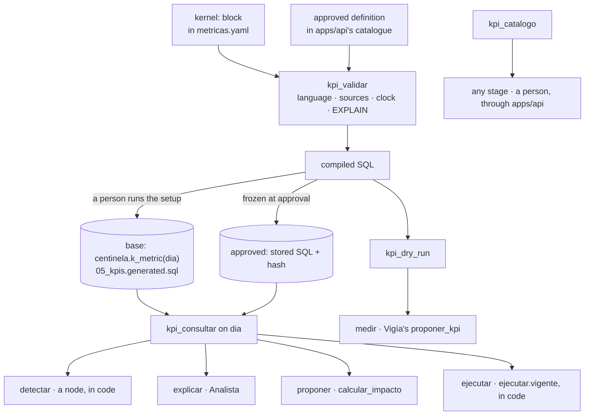
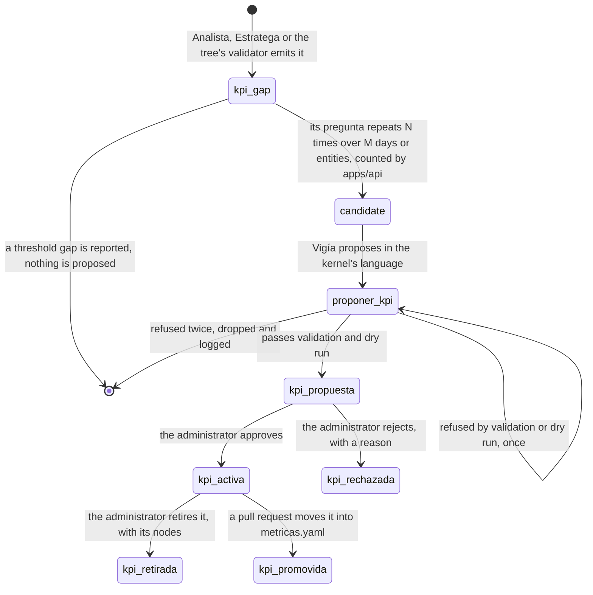

# The KPI kernel

The kernel is a **workbench with a closed language**: it defines every KPI from the same
primitives, compiles each to SQL in code, refuses anything it cannot bound in cost or in time, and
is the one place an agent reads a business measure from. A fact it does not measure, such as a
price or a cost in force, still comes from a `v_*` cause view. This chapter owns what the kernel is
until [data](../../../data/AGENTS.md) and [packages/tools](../../../packages/tools/AGENTS.md) state it.

> **Decided, not implemented.** Today every metric is a hand-written `v_*` view and an entry of
> `metricas.yaml`. No language, compiler, kernel tool, catalogue or `centinela_kernel` role exists.

## A language and a compiler, never free SQL

A KPI is a document of a schema the kernel owns, and the compiler turns it into SQL with
`psycopg.sql` composition, never by string interpolation. No path, for a person or a model, takes
free SQL: what cannot be written cannot be injected. **The language belongs to `data`**, as every
metric's definition does; **the compiler and its tools belong to `packages/tools`**, the only part
that reaches the database.

**A KPI is a function of the simulated day, never a view.** A view cannot take the day, and the
clock section of [data](../../../data/AGENTS.md) shows what that costs. Compiled SQL that takes
`dia` and applies it to every date column is correct on any simulated day by construction; the
compiler refuses a KPI it cannot do that for, uses only complete weeks in a weekly baseline, and
joins a payment only when `fecha_pago <= dia`.

## Three kinds of KPI

| Kind | Defined in | Reaches the database | Runs as |
|---|---|---|---|
| base | its entry of `metricas.yaml`, in a `kernel:` block | when a person sets the database up: the compiler writes `data/sql/05_kpis.generated.sql`, one function `centinela.k_<metric>(dia date)` per metric | the function, called by the read-only user |
| approved | `apps/api`'s catalogue, born by the lifecycle below | never | its frozen compiled SQL, stored with its hash and compiler version at approval, run as stored text with `dia` as a parameter |
| descriptive | either home, with no `fuente_umbral` | as its home says | evidence for `Analista` and `Estratega`; no `detectar` node may compare it, because no threshold exists that a document does not state |

**What runs is what was approved.** The kernel refuses an approved KPI whose stored SQL does not
match its hash, so a change to the compiler never changes an approved KPI, and changes a base KPI
only through the regenerated file a person reviews. An approved KPI that proves its worth is
**promoted** by a person's pull request into `metricas.yaml`. Each `metricas.yaml` entry keeps its
readable `formula` and gains the ISO 22400-2 fields it lacks: `unidad`, `rango`, `tendencia`
(`mayor_es_mejor` or `menor_es_mejor`), `temporalidad`, `audiencia`.

## The language

Every key of a `kernel:` block comes from this closed list; any other key is refused.

| Key | Holds | Bound |
|---|---|---|
| `fuente` | one source declared in `data/kernel/fuentes.yaml` | a closed list |
| `unir` | joins declared for the source, each along a foreign key of the schema | at most three |
| `abierto_al_dia` | a start and a nullable end date column: the rows open on `dia` | one per KPI |
| `ventana` | a date column and a number of days back from `dia` | at most 365 days |
| `filtro` | a column, an operator from `=`, `!=`, `<`, `<=`, `>`, `>=`, `en`, and a literal | at most five; never on a `fuga` column |
| `agrupar` | dimensions the source declares | at most three |
| `medida` | `sum`, `avg`, `count`, `min`, `max`, `mediana` over a column or one arithmetic expression | expression depth two |
| `razon` | a `medida` over another `medida` | one |
| `linea_base` | the same `medida` over the previous periods of `dia`, by `semana` or `mes`, as `delta` or `delta_pct` | at most 12 periods |
| `salida` | the named output columns and the entity column | the entity column is required |

**A source is a table of the schema, never a `v_*` view**, because several views compute "today"
from `fecha_corte()`. `fuentes.yaml` declares each source's table, date columns, entity keys,
dimensions, joins, readable columns, and its `fuga` columns with the reason: `ordenes_compra.estado`
and `pedidos.estado` hold the end of the dataset. A column holding a person's name is not readable.
A test checks every source and column against the schema. A measure the language cannot express is
a defect of the language, fixed by a new primitive with its bound, never by a hand-written function.

## The guards, the roles and the law

| Guard | Checked |
|---|---|
| the bounds of the language table | at validation, before any SQL exists |
| the planner's estimated cost under a cap | `EXPLAIN` on the compiled SQL, at validation |
| a run under `statement_timeout` | at dry run and on every call |
| groups under a cardinality cap | at dry run |

| Role | Granted | Used by |
|---|---|---|
| the read-only user | `SELECT` on the `v_*` views, `EXECUTE` on `centinela.k_*` | the SQL tool, and `kpi_consultar` for base KPIs |
| `centinela_kernel` | `SELECT` on the readable columns of `fuentes.yaml` only, granted column by column; no write grant anywhere | `kpi_dry_run`, and `kpi_consultar` for approved KPIs, inside a read-only transaction |

**No agent changes a database**: not the dataset, not the catalogue, not `apps/api`'s state. A new
KPI is a definition that becomes active, never an object created at runtime; the base functions are
`SECURITY DEFINER`, created only by a person running the setup. No role an agent's tools hold can
write, which makes the grants the gate of the law once they exist; until then no gate holds it. An agent's effects stay where the approval interrupt
and the `bitácora` see them.

## The tools, and who consults the kernel at each stage

All four tools are read-only; the kernel has no action. The model names a KPI by id and never
passes SQL: the orchestrator hands the client's approved KPIs to the kernel as context of the run.

| Tool | Does |
|---|---|
| `kpi_validar` | checks a block against the language, the sources, the clock rules and the planner's cost; returns the compiled SQL |
| `kpi_dry_run` | runs compiled SQL as `centinela_kernel` on a simulated day, under the timeout; returns the first rows, the row count and the time |
| `kpi_consultar` | runs a KPI by id on `dia`, base through its function, approved through its stored SQL after the hash check; returns the rows with the query |
| `kpi_catalogo` | lists the client's KPIs with their ISO 22400-2 fields and whether each is descriptive |

`Ejecutor`'s model consults nothing; `ejecutar.vigente` consults for it.

## Rebuilding the current metrics

Every metric of `metricas.yaml` gains a `kernel:` block and none is dropped or renamed, because the
skills, the action list, the evals and the web's draft contract name them; the list is
`grep -oP '^  \K[a-z_]+(?=:)' data/metricas.yaml`. **Parity is checked in two halves**: on
`fecha_corte()`, where the kit's views are right by definition, the KPI returns the view's rows
value for value; on earlier simulated days, where the views leak, it is checked against a
hand-written as-of query. The kit's views stay as delivered, and `pesos_en_riesgo` and every formula
of `calcular_impacto` read kernel KPIs, so exposure and recovery share one definition.

## How a new KPI is born

The current metrics may not suffice: the customer 6 days late in
[the decision tree](./decision-tree.md) fires none. Centinela must notice a missing measure,
propose one and make it available, while **no person and no text can make it build a measure**.

- **The signal.** A `kpi_gap` holds no free text: its origin (`analista`, `estratega` or `arbol`),
  its anchor (a hypothesis, an action row or a node), the GQM question as a closed shape, the entity
  and the day, and its class, `medida` or `umbral`, decided in code. Only a measure gap reaches the
  kernel, because a threshold changes only by a document.
- **The repetition.** N and M are settings of the method, never a business rule; a rejected question
  is not drafted again until N new gaps arrive.
- **The proposal.** `vigia`/`proponer_kpi` runs with thinking on, and its output schema is the
  kernel's language, so the model can fill only fields the language has: the block, the ISO 22400-2
  fields, a GQM justification with the gaps that triggered it, and a threshold with its
  `fuente_umbral` or neither.
- **The approval activates; nothing is deployed.** Only the `administrador` role decides, and it
  approves or rejects: nobody edits a proposal, because an edit is authoring a KPI. `Vigía` may then
  self-expand `detectar` to read it.

| Method | Path | Purpose |
|---|---|---|
| GET | `/kpis` | the catalogue, base and approved |
| GET | `/kpis/propuestas` | proposals with justification, compiled SQL, dry run and cost |
| POST | `/kpis/propuestas/{id}/decision` | approve, or reject with a reason; no other body |
| POST | `/kpis/{id}/retiro` | retire an approved KPI, with a reason |

| Attack | Why it fails |
|---|---|
| a policy passage or a chat message says "create a KPI that …" | no field of a `kpi_gap` holds text, and `proponer_kpi` reads only the candidate |
| a proposal asks for an unbounded window or a cross join | the language has no such construct, and `EXPLAIN` caps the cost |
| a person posts a `kernel:` block | no endpoint accepts one |
| an approved KPI's SQL is altered after approval | the hash no longer matches |
| a compiled query tries to write | `centinela_kernel` holds no write grant, and the transaction is read-only |
