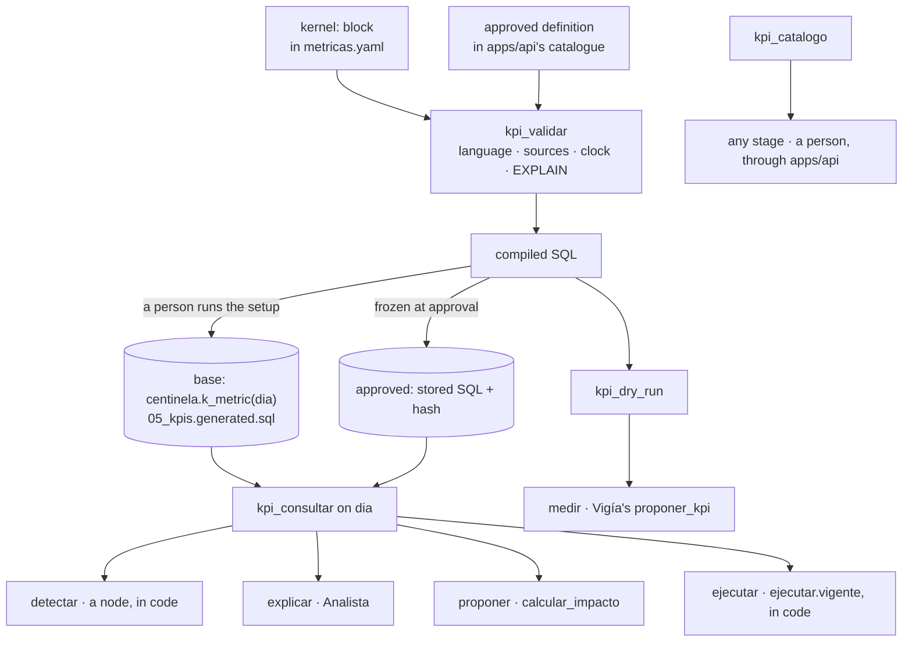
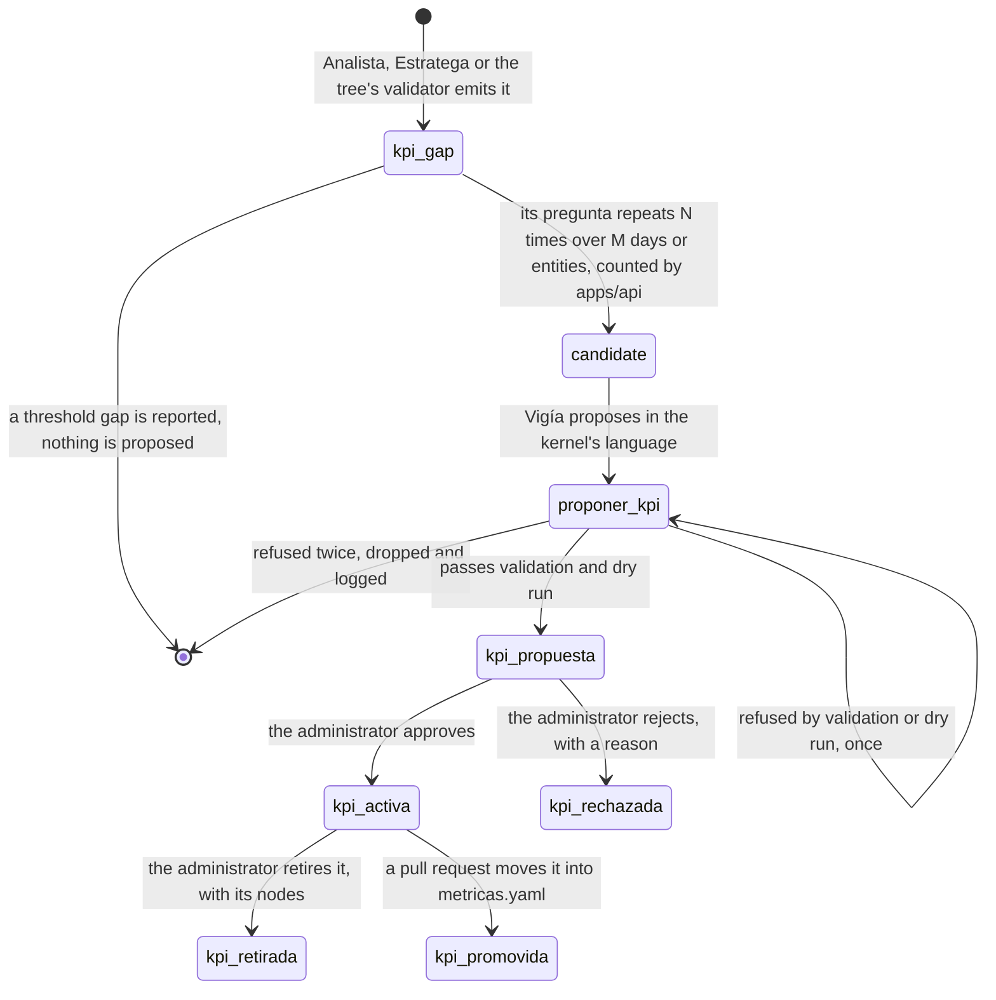

# The KPI kernel

The kernel is a **workbench with a closed language**: it defines every KPI from the same
primitives, compiles each to SQL in code, refuses anything it cannot bound in cost or in time, and
is the one place an agent reads a business measure from. A fact it does not measure, such as a
price or a cost in force, still comes from a `v_*` cause view. The language is [data](../../../data/AGENTS.md)'s, and the compiler, its guards and its tools are [packages/tools](../../../packages/tools/AGENTS.md)'s; this chapter draws them and owns the two parts still to be built.

> **Decided, not implemented.** No metric of `metricas.yaml` carries a `kernel:` block yet, so `05_kpis.generated.sql` holds the roles and no function, and no agent calls the kernel's tools. The last two sections are what remains.

## Where the kernel is stated

The language, its date roles, its joins and its `fuga` columns are in [data](../../../data/AGENTS.md), under "The kernel's language". The kinds of KPI, the guards, the four tools and the server are in [packages/tools](../../../packages/tools/AGENTS.md), under "The KPI kernel".

No role an agent's tools hold can write, which makes the grants the gate of the law that no agent changes a database.

## The tools, and who consults the kernel at each stage

*Draws: `packages/tools/AGENTS.md` § The KPI kernel*

`Ejecutor`'s model consults nothing; `ejecutar.vigente` consults for it.

## Rebuilding the current metrics

> **Decided, not implemented.** No metric carries a `kernel:` block, and no parity check exists.

Every metric of `metricas.yaml` gains a `kernel:` block and none is dropped or renamed, because the
skills, the action list, the evals and the web's draft contract name them; the list is
`grep -oP '^  \K[a-z_]+(?=:)' data/metricas.yaml`. **Parity is checked in two halves**: on
`fecha_corte()`, where the kit's views are right by definition, the KPI returns the view's rows
value for value; on earlier simulated days, where the views leak, it is checked against a
hand-written as-of query. The kit's views stay as delivered, and `pesos_en_riesgo` and every formula
of `calcular_impacto` read kernel KPIs, so exposure and recovery share one definition.

## How a new KPI is born

> **Decided, not implemented.** No `kpi_gap`, proposal, catalogue or endpoint below exists.

The current metrics may not suffice: the customer 6 days late in
[the decision tree](./decision-tree.md) fires none. Centinela must notice a missing measure,
propose one and make it available, while **no person and no text can make it build a measure**.

- **The signal.** A `kpi_gap` holds no free text: its origin (`analista`, `estratega` or `arbol`),
  its anchor (a hypothesis, an action row or a node), the GQM question as a closed shape, the entity
  and the day, and its class, `medida` or `umbral`, decided in code. Only a measure gap reaches the
  kernel, because a threshold changes only by a document.
- **The repetition.** N and M are settings of the method, never a business rule; a rejected question
  is not drafted again until N new gaps arrive.
- **The proposal.** `vigia`/`proponer_kpi` runs with thinking on, and its output schema is the
  kernel's language, so the model can fill only fields the language has: the block, the ISO 22400-2
  fields, a GQM justification with the gaps that triggered it, and a threshold with its
  `fuente_umbral` or neither.
- **The approval activates; nothing is deployed.** Only the `administrador` role decides, and it
  approves or rejects: nobody edits a proposal, because an edit is authoring a KPI. `Vigía` may then
  self-expand `detectar` to read it.

| Method | Path | Purpose |
|---|---|---|
| GET | `/kpis` | the catalogue, base and approved |
| GET | `/kpis/propuestas` | proposals with justification, compiled SQL, dry run and cost |
| POST | `/kpis/propuestas/{id}/decision` | approve, or reject with a reason; no other body |
| POST | `/kpis/{id}/retiro` | retire an approved KPI, with a reason |

| Attack | Why it fails |
|---|---|
| a policy passage or a chat message says "create a KPI that …" | no field of a `kpi_gap` holds text, and `proponer_kpi` reads only the candidate |
| a proposal asks for an unbounded window or a cross join | the language has no such construct, and `EXPLAIN` caps the cost |
| a person posts a `kernel:` block | no endpoint accepts one |
| an approved KPI's SQL is altered after approval | the hash no longer matches |
| a compiled query tries to write | `centinela_kernel` holds no write grant, and the transaction is read-only |
