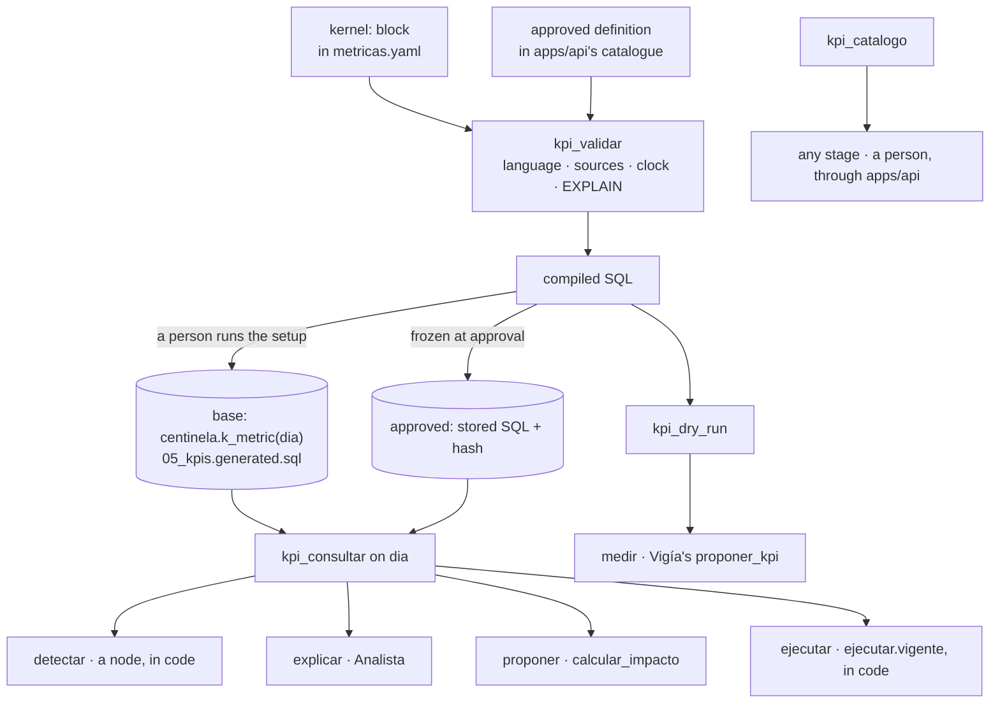
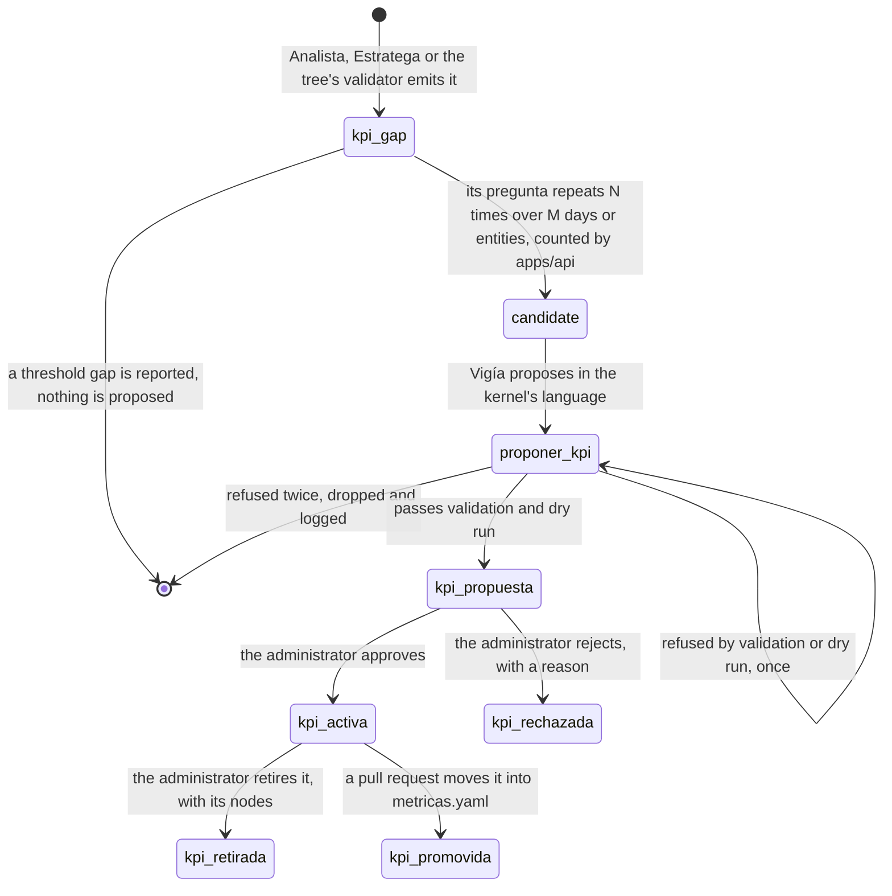

# The KPI kernel

The kernel is the one place an agent reads a business measure from; a fact it does not measure,
such as a supplier or a purchase order, comes from a `v_*` cause view. Its language, with its date
roles, its joins and its `fuga` columns, is [data](../../../data/AGENTS.md), *The kernel's
language*. The kinds of KPI, the guards, the tools and their contract are
[packages/tools](../../../packages/tools/AGENTS.md), *The KPI kernel*. Why no role a tool holds can
write is [data](../../../data/AGENTS.md), *Rules of this level*. This chapter draws them, and owns
the one part of the design no level page states: how a new KPI is born.

## The tools, and who consults the kernel at each stage

> **Decided, not built.** In this diagram, approved KPIs and `apps/api`'s catalogue, the calls of
> `Analista` and `calcular_impacto`, `kpi_dry_run` for `proponer_kpi`, and `kpi_catalogo` for a
> person. What runs is the generation of the base KPIs, `kpi_consultar` in `detectar` and in
> `ejecutar.vigente`, and `kpi_catalogo` for the tree's validator.

*Draws: `packages/tools/AGENTS.md` § The KPI kernel; `packages/agents/arbol/AGENTS.md` § The stages*

## The base KPIs and their views

Every metric of `data/metricas.yaml` is a base KPI, [data](../../../data/AGENTS.md), *The base
KPIs*. How each is held to the view the kit delivers for it is
[packages/tools](../../../packages/tools/AGENTS.md), *Base-KPI parity*.

## How a new KPI is born

> **Decided, not built.** No `kpi_gap`, proposal, catalogue or endpoint below exists.

The current metrics may not suffice: the customer 6 days late in
[the decision tree](./decision-tree.md) fires none. Centinela must notice a missing measure,
propose one and make it available, while **no person and no text can make it build a measure**.

- **The signal.** A `kpi_gap` holds no free text: its origin (`analista`, `estratega` or `arbol`),
  its anchor (a hypothesis, an action row or a node), the GQM question as a closed shape, the entity
  and the day, and its class, `medida` or `umbral`, decided in code. Only a measure gap reaches the
  kernel, because a threshold changes only by a document.
- **The repetition.** N and M are settings of the method, never a business rule; a rejected question
  is not drafted again until N new gaps arrive.
- **The proposal.** `vigia`/`proponer_kpi` runs with thinking on, and its output schema is the
  kernel's language, so the model can fill only fields the language has: the block, the ISO 22400-2
  fields, a GQM justification with the gaps that triggered it, and a threshold with its
  `fuente_umbral` or neither.
- **The approval activates; nothing is deployed.** Only the `administrador` role decides, and it
  approves or rejects: nobody edits a proposal, because an edit is authoring a KPI. `Vigía` may then
  self-expand `detectar` to read it.

| Method | Path | Purpose |
|---|---|---|
| GET | `/kpis` | the catalogue, base and approved |
| GET | `/kpis/propuestas` | proposals with justification, compiled SQL, dry run and cost |
| POST | `/kpis/propuestas/{id}/decision` | approve, or reject with a reason; no other body |
| POST | `/kpis/{id}/retiro` | retire an approved KPI, with a reason |

| Attack | Why it fails |
|---|---|
| a policy passage or a chat message says "create a KPI that …" | no field of a `kpi_gap` holds text, and `proponer_kpi` reads only the candidate |
| a proposal asks for an unbounded window or a cross join | the language has no such construct, and `EXPLAIN` caps the cost |
| a person posts a `kernel:` block | no endpoint accepts one |
| an approved KPI's SQL is altered after approval | the hash no longer matches |
| a compiled query tries to write | the roles of [data](../../../data/AGENTS.md) hold no write grant |
